# Languages School

The Languages School website is a landing page for anyone over the age of 18 wanting to learn one of the following five languages, French, German, Spanish, Chinese or Arabic.
Users of this website shall be able to find all the information that they need to know about Languages School, About the school, what it offers, a timetable, a signup form and contact information. This site is targeted towards adults who wish to learn any of the five languages on offer. 

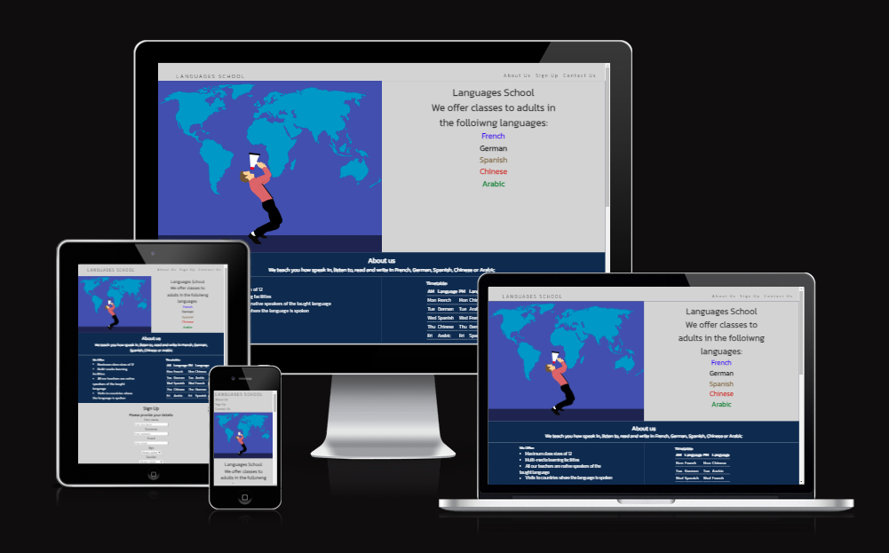

## Features 

- **Navigation**
  - Featured at the top of the page, the navigations shows the club name in the top left corner: LANGUAGES SCHOOL that linkes to the top of the page. 
  - The other navigation links are to the right: About Us, Sign Up and Contact Us which link to the differenet sections of the same page.
  - The navigation is in a clear, easy to read font and a color that contrasts with the background. 
  - The navigation clearly tells the user the name of the school and the website and makes different sections of information easy to find. 

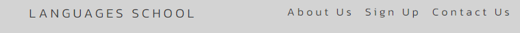

- **The Header**
  - The header shows the name of the school and and the languages that can be learnt there. The languages are shown in colors, French in blue, German in black, Spanish in orange, Chinese in red and Arabic in green.
  - This part of the website provides the user with clear information about what the site is, who it is for and which languages can be learnt there.

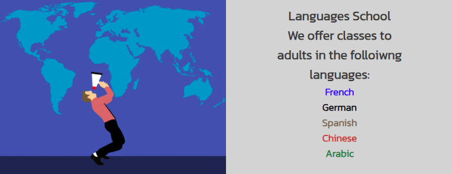    

- **The About Us Section** 
  - The About Us section provides details about what the school offers and a timetable of language classes.
  - This section shows the user the important information that they need to know about the club, what is on offer and class times for each language.

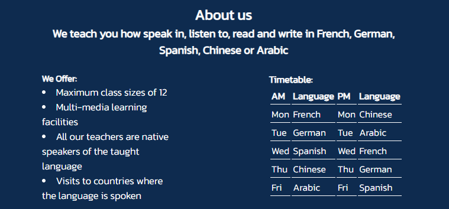

- **The Sign Up form section**
  - The sign up form section has a form to collect details for any adult interested in learning one of the languages at the Languages School. 
  - The form collects the persons first name, surname, email address, age range and gender (although there is a 'prefer not to say' option in the dropdown menu).
  - The person who is interested in signing up must click on the radio button to select one of the languages.
  - There is also a box for the interested person to advise why they wish to learn that language. 

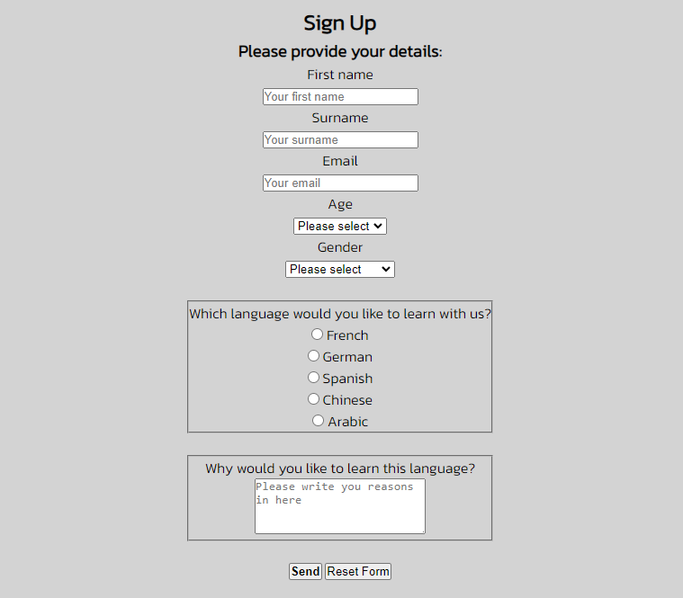

- **The Contact Us section**
  - The Contact Us Section provides a phone mumber, email address and a UK street address where the school can be located. 
  - The contact section is valuable to the user as it gives them the ability to find and contact the Languages School if they need to.

- **The footer**
  - The footer contains links to social media external pages by clicking on icons. These social media sites are Facebook, YouTube and Instagram.
  - Below the social media icons is the copyright of the website author.

## Testing 
  - I tested the webpage in different browsers: Chrome, Firefox, Microsoft Edge and WaveBrowser.
  - I confirmed that the website is reponsive, looks good and functions on all standard screen sizes using the devtools device toolbar. 
  - I confirmed that the navigation, header, about us, sign up and contact us text are all readable and easy to understand.
  - I have confirmed that the navigation bar works and takes the user to the appropriate section of the website.
  - I have confirmed that the form works: requires entries in every field, will only accpet an email in he email field, one radio button must be selected and at least one charachter must be entered into the textarea box.
  - When all the required content has been entered into the Sign Up form and the Send button is pressed, this brings up the entered data into a sperate tab. 
  - I have confimred that the reset button works and clears data entered into the Sign Up form when pressed. 

### Bugs 

**Solved Bugs**
  - While using DevTools, I noticed that there were warnings regarding the site.webmanifest part of the code in the FavIcon section in the Head was not linking correctly. This was resolved with tutor support help.

  - Updating the url to add a dot before the trailing slash to indicate the png is in the same directory fixed the problem.

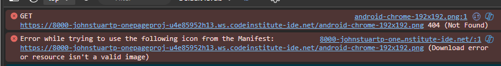

**Validator Testing**
- HTML 
  - No errors were retunred when passing through the official W3C validator.
- CSS 
  - No errors were retunred when passing through the official (Jigsaw) validator.
- Accessibility 
  - I confirmed thath the colors and fonts chosen are easy to read and accessible by running it through Lighthouse in both mobile and deskptop in Dev Tools.
  - WAVE was also used to test validity

**HTML testing, W3C validator**

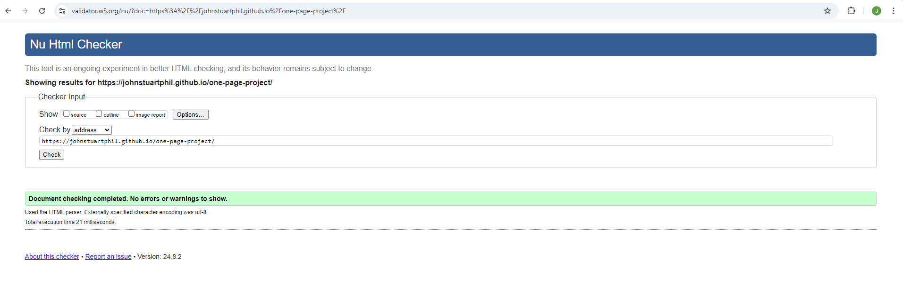

**CSS testing, Jigsaw validator**

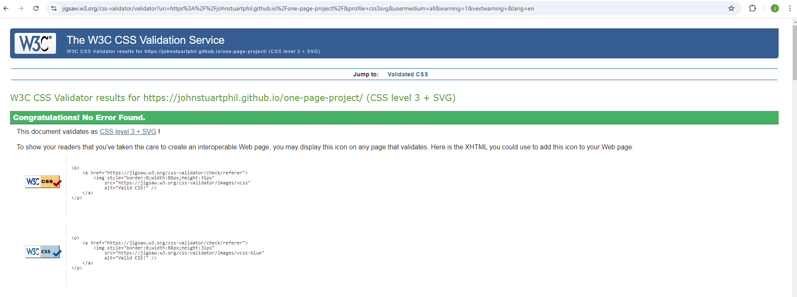

**Lighthouse results:**

|   | Performance  |Accesibility   |Best Practices    | SEO  |
|---|---|---|---|---|
| Mobile:  |  90 | 100  | 100  |100   |
| Desktop:  | 99  | 100  | 100  | 100  |

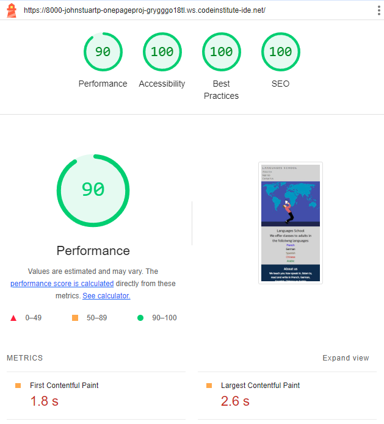

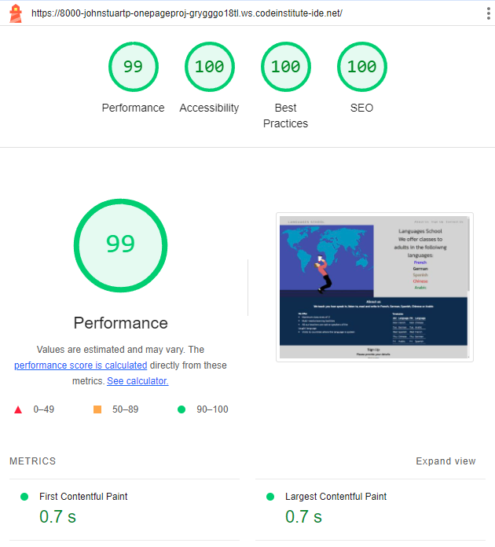

**Wave results:**

| Errors  | Contrast errors  | Alerts  | Features  | Structural Elements  | ARIA  |
|---|---|---|---|---|---|
|  0 |  0 | 0  |  15 | 28  | 6  |

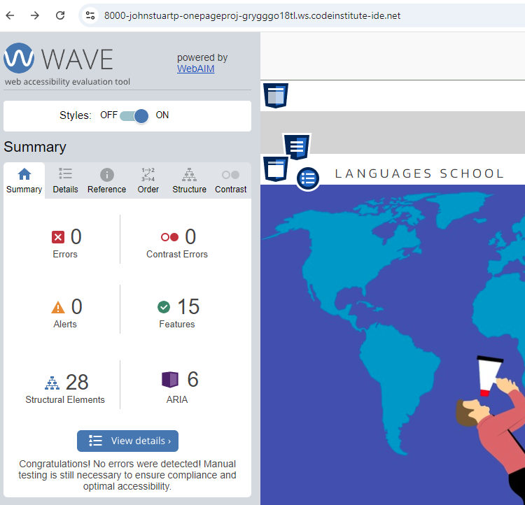

## Deployment 
- The site was deployed to GitHub pages. The steps to deploy are as follows:

  - Go to the Settings tab of the GitHub repository.
  - In the code and automation section, select Pages.
  - In the build and Deployment section, under the Source section select Deploy from a Branch.
  - In the build and Deployment section, under the Branch section Main branch and Root file.
  - Within a few minutes the live site shall then be refreshed

The live link can be found here - https://johnstuartphil.github.io/one-page-project/

## Credits 

**Content**
- The code to make the Asterisk wildcard sleector, general styles in the body, Navigation Bar of the CSS and the Social Media linkes were taken from the Love Running Project and edited accordingly.
- The code to make the Sign Up form was taken from the Coders Cafe tutorial and edited accordingly.
- The code to style the timetable was taken from www.w3schools.com and edited accordingly - https://www.w3schools.com/css/css_table_style.asp
- The icons used for the the Social Media links were taken from https://fontawesome.com/
- The fav icon was constructed from https://favicon.io/
- The Inter and Kannit fonts were taken from https://fonts.google.com/

**Media** 
- The Hero image was taken from PXHere - https://pxhere.com/en/photo/1447727