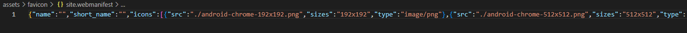

# Languages School

The Languages School website is a landing page for anyone over the age of 18 wanting to learn one of the following five languages: French, German, Spanish, Chinese or Arabic.
Users of this website shall be able to find all the information that they need to know about Languages School, what it offers, a timetable, a signup form and contact information. This site is targeted towards adults who wish to learn any of the five languages on offer. 

## Features 

- **Navigation**
  - Featured at the top of the page, the navigation bar shows the school name in the top left corner: LANGUAGES SCHOOL that links to the header. 
  - The other navigation links are to the right: About Us, Sign Up and Contact Us which link to the different sections of the page.
  - The navigation is in a clear, in an easy to read font and in a color that contrasts with the background. 
  - The navigation clearly tells the user the name of the school and the website, and makes different sections of information easy to find. 

- **The Header**
  - The header shows the name of the school and and the languages that can be learnt there. The languages are displayed in the following colors: French in blue, German in black, Spanish in orange, Chinese in red and Arabic in green.
  - This part of the website provides the user with clear information about what the site is, who it is for and which languages can be learnt there.

    

- **The About Us Section** 
  - The About Us section provides details about what the school offers and a timetable of language classes.
  - This section shows the user the important information that they need to know about the school, what is on offer and which mornings and afternoons each language is taught on during the week.

- **The Sign Up form section**
  - The sign up form section has a form to collect details for any adult (18+) interested in learning one of the languages available on offer at the Languages School. 
  - The form collects the persons first name, surname, email address, age range and gender (although there is a 'prefer not to say' option in the gender dropdown menu).
  - The person who is interested in signing up must click on a radio button to select the language that they are interested in learning.
  - There is also a box for the interested person to advise why they wish to learn that particular language. At least one charcter must be entered into this box.

- **The Contact Us section**
  - The Contact Us Section provides a telephone mumber, an email address and a UK street address where the school can be located. 
  - The contact section is valuable to the user as it gives them the ability to find and contact the Languages School should they need to.

- **The footer**
  - The footer contains links to social media external pages by clicking on the icons. These social media sites are: Facebook, YouTube and Instagram.
  - Below the social media icons is the copyright of the website author and year of publication.

## Testing 
  - I tested the webpage in different browsers: Chrome, Firefox, Microsoft Edge and WaveBrowser.
  - I confirmed that the website is reponsive, looks good and functions on all standard screen sizes using the devtools device toolbar. 
  - I confirmed that the navigation, header, about us, sign up and contact us text are all readable and easy to understand.
  - I confirmed that the navigation bar works and takes the user to each appropriate section of the website.
  - I confirmed that the signup form works: it requires entries in every field, it shall only accept an email in he email field, one radio button must be selected and at least one charachter must be entered into the textbox.
  - When all the required content has been entered into the Sign Up form and the Send button is pressed, this brings up the entered data into a sperate tab. 
  - I confimred that the Reset Form button works and clears data entered into the Sign Up form when pressed. 

**Summary of testing**

| Test  | Section  | Action  | Result  | Pass/Fail  |
|---|---|---|---|---|
| 1  | Nav Bar  |Clicked on About Us   | Took to About Us section  | Pass  |
| 2  | Nav Bar  | Clicked on Sign Up  |  Took to Sign Up section | Pass  |
| 3  | Nav Bar  | Clicked on Contact Us   | Took to Contact Us section  |  Pass |
| 4  | Sign Up   | Clicked on Send button without any information filled in   | Instructed to fill in first name   | Pass  |
| 5 | Sign Up  | Clicked on Send button with only first name filled in   | Instructed to fill in surname   | Pass  |
| 6 |  Sign Up  | Clicked on Send button with only first name and surname filled in   | Instructed to fill in email address  |  Pass |
|  7 | Sign Up   | Clicked on Send button with only first name, surname and email address filled in   |Instructed to select an age range   |  Pass |
| 8  | Sign Up   | Clicked on Send button with only first name, surname, email address filled in and age range selected  | Instructed to select a gender  | Pass  |
| 9  | Sign Up   | Clicked on Send button with only first name, surname, email address filled in, age range and gender selected  | Instructed to select a language  | Pass  |
|  10 | Sign Up   | Clicked on Send button with only first name, surname, email address filled in, age range, gender and a language selected  | Instructed to fill in the text box  |  Pass |
| 11  | Sign Up   |  Clicked on Send button with first name, surname, email address filled in, age range, gender, a language selected and at least one character in the text box | Opened up new tab with the data provided  |  Pass |
| 12  | Sign Up   | Clicked on Reset Form button with the form filled in  | Reset the form blank |  Pass |

### Bugs 

**Solved Bugs**
  - While using DevTools, I noticed that there were warnings regarding the site.webmanifest part of the code in the FavIcon section was not linking correctly. This was resolved with tutor support help.

  - Updating the url to add a dot before the trailing slash to indicate the png is in the same directory fixed the problem.

  

**Validator Testing**
- HTML 
  - No errors were retunred when passing through the official W3C validator.
- CSS 
  - No errors were retunred when passing through the official (Jigsaw) validator.
- Accessibility 
  - I confirmed that the colors and fonts chosen, are easy to read and accessible by running it through Lighthouse in both mobile and deskptop in Dev Tools.
  - WAVE was also used to test validity which has no errors nor contrast errors.

**HTML testing, W3C validator**

**CSS testing, Jigsaw validator**

**Lighthouse results:**

|   | Performance  |Accesibility   |Best Practices    | SEO  |
|---|---|---|---|---|
| Mobile:  |  90 | 100  | 100  |100   |
| Desktop:  | 99  | 100  | 100  | 100  |

**Wave results:**

| Errors  | Contrast errors  | Alerts  | Features  | Structural Elements  | ARIA  |
|---|---|---|---|---|---|
|  0 |  0 | 0  |  15 | 28  | 6  |

## Deployment 
- The site was deployed to GitHub pages. The steps to deploy are as follows:

  - Go to the Settings tab of the GitHub repository.
  - In the code and automation section, select Pages.
  - In the build and Deployment section, under the Source section select Deploy from a Branch.
  - In the build and Deployment section, under the Branch section Main branch and Root file.
  - Within a few minutes the live site shall then be refreshed.

The live link can be found here - [Languages School](https://johnstuartphil.github.io/one-page-project/)

## Forking the Repository
- To Folk a repository, the steps are as follows:
  
  - Go to the Code tab of the GitHub repository.
  - Click on the down arrow of the Folk section.
  - This should create a copy of the repository in your own repository.
  - This copy could be used for testing purposes only without affecting the main repository.

## Cloning the Repository
- To make a clone of a repository, the steps are as follows:

  - Go to the Code tab of the GitHub repository.
  - Click on the down arrow of the green code button.
  - Select a URL provided and copy it to the clipboard.
  - Enter the URL into your browser.
  - Click on the green Gitpod Open button to open up Gitpod.
  - Type 'git clone'.
  - This shall bring up the slected repository at the time it was cloned ready to be edited.

## Credits 

**Content**
- The style of the website was influenced from the Sample project.
- The code to make the Asterisk wildcard sleector, general styles in the body, Navigation Bar of the CSS and the Social Media links were taken from the Love Running walkthrough project and edited accordingly.
- The code to make the Sign Up form was taken from the Coders Cafe tutorial and edited accordingly.
- The code to style the timetable was taken from [W3Schools](https://www.w3schools.com/css/css_table_style.asp) and edited accordingly.
- The icons used for the the Social Media links were taken from [Font Awesome](https://fontawesome.com/).
- The Fav Icon was constructed from [Fav Icon](https://favicon.io/).
- The Inter and Kannit fonts were taken from [Google Fonts](https://fonts.google.com/).
- The Hero image was taken from [PXHere](https://pxhere.com/en/photo/1447727).

**Thanks to**

- Mentors: Matthew Bodden, David Bowers 
- Tutors: Gemma, Oisin, Roo, Sarah, Thomas
- Student Care: Kieron 